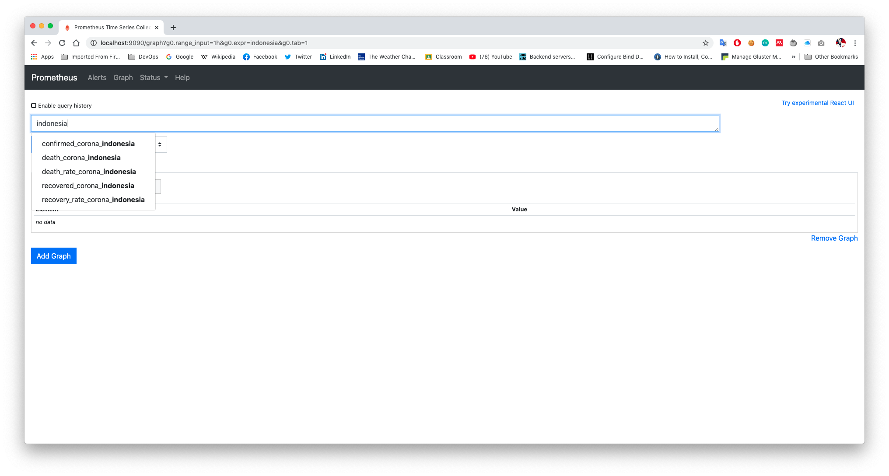

# corona-prometheus-exporter
This is corona exporter for prometheus

Metrics | Description
------------- | -------------
confirmed_corona_\<CountryName>  | Current total confirmed positive COVID19 in specified country
death_corona_\<CountryName>  | Current total death people in specified country
recovered_corona_\<CountryName> | Current total recovered people in specified country
recovery_rate_corona_\<CountryName> | Current recovery rate COVID19 in specified country
death_rate_corona_\<CountryName> | Current case fatality rate COVID19 in specified country

### How To Run
```cassandraql
$ ./corona-exporter --country=indonesia
```

Default listen address in this exporter is 0.0.0.0:10198 if you want to change use listen.port flag

```cassandraql
$ ./corona-exporter --country=indonesia --listen.address="127.0.0.1:8081"
```

### Screenshot



