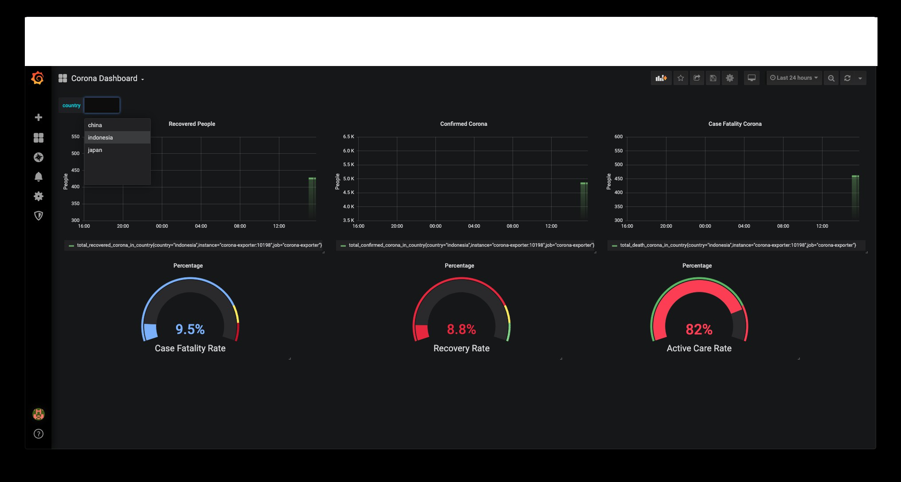

# corona-prometheus-exporter
This is corona exporter for prometheus

Metrics | Description
------------- | -------------
total_confirmed_corona_in_country  | Current total confirmed positive COVID19 in specified country
total_death_corona_in_country | Current total death people in specified country
total_recovered_corona_in_country | Current total recovered people in specified country
recovery_rate_corona_in_country | Current recovery rate COVID19 in specified country
death_rate_corona_in_country | Current case fatality rate COVID19 in specified country

### How To Run
```cassandraql
$ ./corona-prometheus-exporter --country=indonesia
```

Default listen address in this exporter is 0.0.0.0:10198 if you want to change use _listen.address_ flag.
You can change update interval too, with _update.interval_ flag, change the number what ever you want. 
```cassandraql
$ ./corona-prometheus-exporter --country=indonesia --update.interval=15 --listen.address="127.0.0.1:8081"
```

```cassandraql
Usage of ./corona-prometheus-exporter:
  -country string
        Country name you want to get COVID19 status.
        Separate with comma ',' to use multiple country
  -listen.address string
         listen address (default ":10198")
  -update.interval duration
        Update interval in minutes (default 5)

```

We provide you with example docker-compose file in this repo, you can use it

Use this command:

```cassandraql
$ docker-compose up
```

If you already have prometheus and grafana and just want to use dashboard, the json is in the dashboard folder in this repo

### Screenshot



